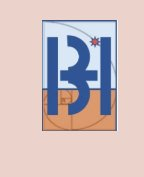

# BHAR India Website — Deployment Guide
**Blue Horizon Automation Research | bharindia.com**

---

## 📁 File Structure
```
bhar-website/
├── index.html              ← Homepage
├── sitemap.xml             ← SEO sitemap
├── robots.txt              ← Search engine rules
├── css/
│   ├── style.css           ← Main styles (variables, layout, nav, hero, footer)
│   ├── components.css      ← Page-specific components (cards, modals, forms, team)
│   └── responsive.css      ← Breakpoints: 1400 / 1200 / 1024 / 768 / 480 / 360px
├── js/
│   ├── theme.js            ← Dark/Light mode toggle + localStorage
│   ├── main.js             ← Navigation, scroll, modals, tabs, animations
│   └── form.js             ← Contact form validation + email submission
├── images/                 ← Add your images here
│   ├── favicon.png
│   ├── logo.png
│   └── og-home.jpg         (1200×630 Open Graph image)
└── pages/
    ├── services.html        ← RPA, Web Apps, Consulting
    ├── products.html        ← 5 products with tabs
    ├── projects.html        ← 6 project cards + modal popups
    ├── about.html           ← Company, leadership, team, social
    ├── contact.html         ← Form, info, map, FAQ
    └── blog.html            ← 9 blog posts with filter + search
```

---

## 🚀 How to Run Locally

### Option A — Direct open (no server needed)
Just double-click `index.html` — it will open in your browser. All relative links work.

### Option B — Local server (recommended, avoids CORS issues)
```bash
# Python 3
python -m http.server 8000
# Then visit: http://localhost:8000

# Node.js (install live-server globally)
npx live-server
```

---

## ☁️ Deployment Options

### Option 1: Upload to Wix → No, use any static host
Since this is plain HTML/CSS/JS, don't use Wix — use:

### Option 2: Netlify (recommended, free)
1. Go to [netlify.com](https://netlify.com)
2. Drag and drop the `bhar-website/` folder
3. Done! Your site is live instantly with HTTPS.

### Option 3: Vercel
```bash
npm install -g vercel
cd bhar-website
vercel
```

### Option 4: cPanel Hosting (traditional)
1. Zip the entire `bhar-website/` folder
2. Upload to your hosting's `public_html/` via File Manager or FTP
3. Extract the zip

### Option 5: GitHub Pages
1. Push folder to GitHub repo
2. Settings → Pages → Deploy from main branch / root

---

## 📧 Contact Form Setup

The form supports **three methods** — configure in `js/form.js` (`FORM_CONFIG` object at the top):

### Method A: EmailJS (recommended — no backend)
1. Sign up free at [emailjs.com](https://emailjs.com)
2. Create an Email Service (Gmail/Outlook) + Email Template
3. In `form.js`, set:
   ```js
   USE_EMAILJS: true,
   EMAILJS_SERVICE_ID: 'your_service_id',
   EMAILJS_TEMPLATE_ID: 'your_template_id',
   EMAILJS_PUBLIC_KEY: 'your_public_key',
   ```
4. Add this script to `contact.html` before `</body>`:
   ```html
   <script src="https://cdn.jsdelivr.net/npm/@emailjs/browser@3/dist/email.min.js"></script>
   ```

### Method B: Formspree (simplest)
1. Sign up free at [formspree.io](https://formspree.io)
2. Create a form → copy your form ID
3. In `form.js`, set:
   ```js
   USE_FORMSPREE: true,
   FORMSPREE_ENDPOINT: 'https://formspree.io/f/YOUR_FORM_ID',
   ```

### Method C: Custom Node.js Backend
```js
// In form.js:
USE_CUSTOM_API: true,
CUSTOM_API_URL: 'https://your-api.com/api/contact',

// Simple Express.js endpoint:
const nodemailer = require('nodemailer');
app.post('/api/contact', async (req, res) => {
  const transporter = nodemailer.createTransporter({ /* your SMTP config */ });
  await transporter.sendMail({
    from: req.body.from_email,
    to: 'customerdelight@bhar.co.in',
    subject: req.body.subject,
    text: req.body.message,
  });
  res.json({ success: true });
});
```

---

## 🗺️ Google Maps Setup

In `pages/contact.html`, find the `contact-map` section and replace the `map-placeholder` div with:
```html
<iframe
  src="https://www.google.com/maps/embed?pb=YOUR_EMBED_URL"
  width="100%" height="100%"
  style="border:0;" allowfullscreen="" loading="lazy"
  referrerpolicy="no-referrer-when-downgrade"
  title="BHAR India Office Location"
></iframe>
```
Get your embed URL: Google Maps → Search location → Share → Embed a map → Copy iframe src.

---

## 👤 Team Photos

Replace the emoji placeholders in `about.html` with real images:
```html
<!-- Replace this: -->
<div class="team-card-photo">👤</div>

<!-- With this: -->
<div class="team-card-photo">
  
</div>
```
Store team photos in: `/images/team/`

---

## 🔍 SEO Checklist

- [ ] Replace all `YOUR_MAP_EMBED_URL` with real maps
- [ ] Add real team photos with descriptive `alt` tags
- [ ] Update `sitemap.xml` with actual `<lastmod>` dates
- [ ] Add `og-home.jpg` (1200×630px) to `/images/`
- [ ] Update `favicon.png` and `apple-touch-icon.png`
- [ ] Submit `sitemap.xml` to Google Search Console
- [ ] Set up Google Analytics or Plausible

---

## 🎨 Customization

### Change colors (edit `css/style.css` `:root`):
```css
:root {
  --primary: #0052CC;   /* Main blue */
  --accent:  #00B4D8;   /* Cyan accent */
}
[data-theme="dark"] {
  --bg: #060C1A;        /* Dark background */
}
```

### Add your real logo:
In `index.html` and all pages, replace the `nav-logo-mark` div:
```html

```

### Update team/leadership names in `about.html`:
Search for "Founder Name", "Director Name", "Team Member 1–6" and replace with real data.

---

## 📞 Contact Details
- **Phone**: +91 87226 29900
- **Email**: customerdelight@bhar.co.in
- **LinkedIn**: linkedin.com/company/blue-horizon-automation

---

*Built with HTML5, CSS3, Vanilla JavaScript — no frameworks, no dependencies, maximum performance.*
